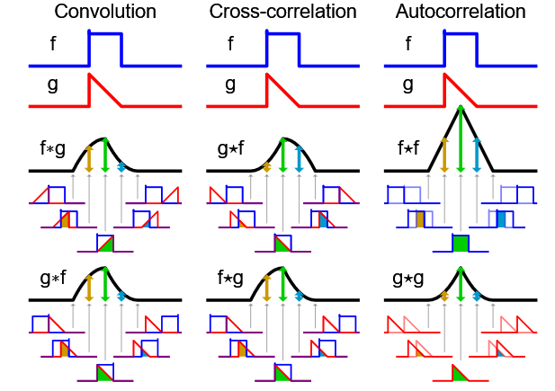

# Convolution & Cross-correlation
The primary implement of convolution and cross-correlation.
# Notes
You can refer to the complete notes from [04 Notes](04_notes.pdf)
## Linear Systems(Filter)
Denotes the input function:
$$f[m,n]$$
Filter is used to convert input function to an output(or response) function:
$$g[m,n]$$
$\mathcal{S}$ is refered to as *system operator* which maps a member of the set of possible
outputs $g[m,n]$ to a member of the set of possible inputs $f[m,n]$. When using notation involving $\mathcal{S}$, we can write that
$$\begin{aligned}
    \mathcal{S}[g]&=f \\
    \mathcal{S}\left\{f[m,n]\right\}&=g[m,n] \\
    f[m,n]&\xmapsto{\mathcal{S}}g[m,n]
\end{aligned}$$
### Examples of Filters
#### Moving Average
If we want to smooth or blur the image, we can set the value of a pixel to be the average of its neighboring pixels:
$$g[m,n]=\frac{1}{9}\sum_{i=-1}^{1}\sum_{j=-1}^1f[m-i,n-j]$$
#### Image Segmentation
The value of a pixel can be set:
$$g[m,n]=\begin{cases}
255 & f[m,n]\geq{t}\\
0&\text{otherwise}
\end{cases}$$
### Properties of Systems
Not all systems will have the following(or any) of these properties in general. You can refer to the notes or slide about other properties.
#### Amplitude Properties
1. Superposition(叠加原理)
$$\mathcal{S}[\alpha{f_i[n,m]}+\beta{f_j[n,m]]}=\alpha\mathcal{S}[f_i[n,m]]+\beta\mathcal{S}[f_j[n,m]]$$
#### Properties of Systems
1. Shift Invariance(平移不变性)
$$f[n-m_0,n-n_0]\xrightarrow{\mathcal{S}}g[m-m_0,n-n_0]$$
### Linear Systems
**A linear system is a system that satisfies the property of superposition.**

Linear systems are also known as *impulse response[脉冲响应](https://zh.wikipedia.org/wiki/%E5%86%B2%E6%BF%80%E5%93%8D%E5%BA%94)* of a system $\mathcal{S}$. Consider a function $\delta_2[m,n]$:
$$\delta_2[m,n]=\begin{cases}
    1&m=0\text{ and }n=0\\
    0&\text{otherwise}
\end{cases}$$
The response $r$:
$$r=\mathcal{S}[\delta_2]$$
A simple linear shift-invariant system is a system that shifts the pixels of an image, based on the shifting property of the delta function.
$$f[m,n]=\sum_{i=-\infty}^\infty\sum_{j=-\infty}^\infty{f[i,j]\delta_2[m-i,n-j]}$$
Then we can use the superposition property to write *any* linear shift-invariant system as a weighted sum of such shifting system:
$$\alpha_1\sum_{i=-\infty}^\infty\sum_{j=-\infty}^\infty{f[i,j]\delta_{2,1}[m-i,n-j]}+\alpha_2\sum_{i=-\infty}^\infty\sum_{j=-\infty}^\infty{f[i,j]\delta_{2,}[m-i,n-j]}+\cdots$$
We can define the filter $h$ of a linear shift-invariant system as
$$h[m,n]=\alpha_1\delta_{2,1}[m-i,n-j]+\alpha_2\delta_{2,2}[m-i,n-j]+\cdots$$
Linear shift invariant systems(LSI):
- Systems that satisfy the superposition property
- Have an *impulse response*: $\mathcal{S}[\delta_2[n,m]]=\delta_2[n,m]$
- Discrete convolution: $f[n,m]*h[n,m]$(multiplication of shifted-version of impulse response by original function)
# Convolution and Correlation
## Convolution
The impulse function $\delta[n]$ is defined to be 1 at $n=1$ and 0 elsewhere. For an arbitrary input signal $x$ can be written as $x[n]=\sum_{k=-\infty}^\infty{x[k]\delta[n-k]}$. If we pass the equation into a linear, shift-invariant system, the output is $y[n]=\sum_{k=-\infty}^\infty{x[k]h[n-k]}$, i.e the convolution of the signal $x$ with the impulse response $h$.

However, an image is written in form of matrix. For a linear, shift-invariant system, the output is $y[n,m]=\sum_{i=-\infty}^\infty\sum_{j=-\infty}^\infty{x[i,j]h[n-i,m-j]}$
,i.e the convolution of the signal $x$ with the impulse response $h$ in 2 dimensions.
## Correlation(互相关)
[Cross Correlation](https://en.wikipedia.org/wiki/Cross-correlation) is often used to measure the similarity of two images. cross correlation is the same as convolution, except that the filter kernel is not flipped. Two-dimensional cross correlation is:
$$r[k,l]=\sum_{m=-\infty}^\infty\sum_{n=-\infty}^\infty{f[m+k,n+l]}g[m,n]$$
## Summary
The steps for discrete convolution are:
- Fold $h[k,l]$(折叠) about origin to form $h[-k]$
- Shift th folded results by $n$ to form $h[n-k]$
- Multiply $h[n-k]$ by $f[k]$
- Sum over all $k$
- Repeat for every n

However, cross correlation doesn't have to fold the filter. The convolution amis to calculate the value of weighted $f[m,n]$ by folded and shifted filter $f[k,l]$

In this picture, we assume function $f$ and its height is 1.0. The value of the result at 5 different points is indicated by the shaded area below each point. Also, the symmetry of f is the reason f*g and $f\star{g}$ are identical in this example.

Cross correlation doesn't satisfy commutative property(交换律):
$$f\star{g}(t)=(g\star{f})(-t)$$
However, convolution satisfy commutative property:
$$f*g=g*f$$
# How to run
1. `hw1.ipynb` is interface for user to debug/visualize the code in `filter.py`
# References
1. Stanford CS131 lecture #4 note & slide
2. [Convolution(Wikipedia)](https://zh.wikipedia.org/wiki/%E5%8D%B7%E7%A7%AF)
3. [Cross Correlation](https://zh.wikipedia.org/wiki/%E4%BA%92%E7%9B%B8%E5%85%B3)